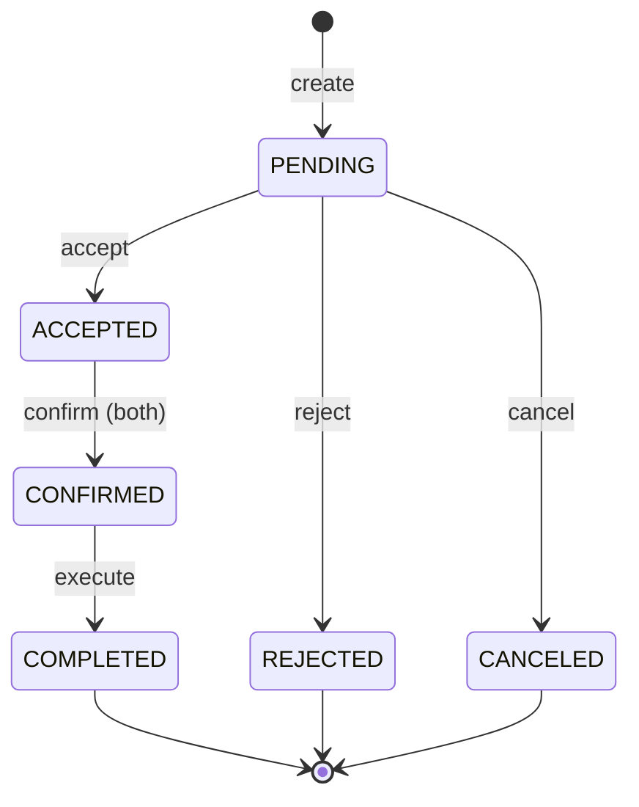

# Two-Phase Commit (2PC) Trade Mechanism

## Overview

The Distributed Virtual Town implements a centralized Two-Phase Commit (2PC) protocol for peer-to-peer trading between villagers. The Merchant node acts as the transaction coordinator, ensuring atomic and consistent trades across the distributed system.

## Key Concepts

### Why 2PC?

In a distributed system where villagers run on different nodes, we need to ensure:
1. **Atomicity**: Either both parties complete the trade, or neither does
2. **Consistency**: No partial trades or resource duplication
3. **Isolation**: Concurrent trades don't interfere with each other
4. **Durability**: Completed trades persist in the system

The 2PC protocol provides these guarantees through a coordinated commit process.

### Architecture

```
┌─────────────┐         ┌──────────────┐         ┌─────────────┐
│   Alice     │         │   Merchant   │         │     Bob     │
│ (Initiator) │ ◄─────► │ (Coordinator)│ ◄─────► │  (Target)   │
│   Node 1    │         │   Node 0     │         │   Node 2    │
└─────────────┘         └──────────────┘         └─────────────┘
```

- **Merchant**: Central coordinator managing all trades
- **Initiator**: Party who creates the trade request
- **Target**: Party who receives and responds to the trade request

## Visual Guides

### 1. State Transition Diagram

See [2PC_Trade_State_Diagram.md](./2PC_Trade_State_Diagram.md) for detailed state descriptions.

**Quick View:**



### 2. Successful Trade Sequence

See [2PC_Trade_Sequence.mermaid](./2PC_Trade_Sequence.mermaid) for the complete interaction diagram.

**Phases:**
1. **Creation**: Initiator creates trade request → PENDING
2. **Acceptance**: Target validates and accepts → ACCEPTED
3. **Commit**: Both parties confirm → CONFIRMED → COMPLETED

### 3. Rollback Scenario

See [2PC_Trade_Rollback.mermaid](./2PC_Trade_Rollback.mermaid) for failure handling.

**Rollback Triggers:**
- Insufficient resources during execution
- Network failure during atomic transfer
- Any step in the 4-step execution fails

## Protocol Phases

### Phase 1: Prepare (PENDING → ACCEPTED)

1. **Initiator** creates trade request via Merchant
2. **Merchant** stores trade in PENDING state
3. **Target** receives notification of pending trade
4. **Target** validates resources (has enough items/money)
5. **Target** accepts → Trade moves to ACCEPTED
6. **Alternative**: Target rejects → REJECTED (terminal state)

**Key Point**: Resource validation happens here to fail fast if trade is impossible.

### Phase 2: Commit (ACCEPTED → CONFIRMED → COMPLETED)

1. **Both parties** must call `confirm` endpoint
2. **Merchant** tracks confirmations:
   - `initiator_confirmed = true`
   - `target_confirmed = true`
3. When both confirmed → CONFIRMED state
4. **Merchant** executes atomic transfer:
   - Buyer pays money
   - Seller deducts item
   - Buyer receives item
   - Seller receives money
5. Success → COMPLETED (trade removed from active list)
6. Failure → Rollback all changes

## API Reference

### Create Trade
```http
POST /trade/create
{
  "initiator_id": "node1",
  "target_id": "node2",
  "offer_type": "buy",
  "item": "wheat",
  "quantity": 3,
  "price": 21
}
```

### Accept Trade
```http
POST /trade/accept
{
  "trade_id": "trade_1",
  "node_id": "node2"
}
```

### Confirm Trade
```http
POST /trade/confirm
{
  "trade_id": "trade_1",
  "node_id": "node1"  // or "node2"
}
```

### Query Trades
```http
GET /trade/list?node_id=node1&type=pending
GET /trade/list?node_id=node1&type=sent
```

## Example Scenarios

### Scenario 1: Successful Wheat Trade

**Setup:**
- Alice (farmer) has 10 wheat, 100 gold
- Bob (chef) has 2 wheat, 150 gold

**Flow:**
```
1. Alice: trade node2 sell wheat 3 21
   → PENDING: Alice offers to sell 3 wheat for 21 gold total

2. Bob: trades (sees pending request)
   → Sees: trade_1 from Alice

3. Bob: accept trade_1
   → ACCEPTED: Bob validates (has 150 gold ≥ 21)

4. Bob: confirm trade_1
   → ACCEPTED: target_confirmed = true

5. Alice: confirm trade_1
   → CONFIRMED: initiator_confirmed = true
   → COMPLETED: Atomic execution
     - Bob: 150 → 129 gold
     - Alice: 10 → 7 wheat
     - Bob: 2 → 5 wheat
     - Alice: 100 → 121 gold
```

**Result:**
- Alice: -3 wheat, +21 gold
- Bob: +3 wheat, -21 gold

### Scenario 2: Insufficient Resources

**Setup:**
- Alice wants to buy 5 wheat
- Bob only has 2 wheat

**Flow:**
```
1. Alice: trade node2 buy wheat 5 35
   → PENDING

2. Bob: accept trade_1
   → FAILED: Bob doesn't have 5 wheat
   → Response: "Target does not have enough wheat"
   → Trade remains PENDING or automatically REJECTED
```

### Scenario 3: Price Negotiation via Rejection

**Flow:**
```
1. Alice: trade node2 buy wheat 3 15
   → PENDING: Offers 5 gold per wheat

2. Bob: reject trade_1
   → REJECTED: Price too low (merchant sells at 10 each)

3. Alice: trade node2 buy wheat 3 21
   → PENDING: New offer at 7 gold per wheat

4. Bob: accept trade_2
   → ACCEPTED: Better price

5-6. Both confirm → COMPLETED
```

## Implementation Details

### Atomic Execution

```python
def execute_trade(trade):
    """4-step atomic execution with rollback"""
    try:
        # Step 1: Buyer pays
        if not deduct_money(buyer, amount):
            return False
        
        # Step 2: Seller loses item
        if not remove_item(seller, item, qty):
            refund_money(buyer, amount)  # Rollback step 1
            return False
        
        # Step 3: Buyer gains item
        if not add_item(buyer, item, qty):
            # Rollback steps 1 & 2
            refund_money(buyer, amount)
            restore_item(seller, item, qty)
            return False
        
        # Step 4: Seller gains money
        if not add_money(seller, amount):
            # Rollback all previous steps
            return False
        
        return True
    except Exception:
        # Any exception triggers full rollback
        rollback_all()
        return False
```

### Concurrency Control

The Merchant maintains a global `active_trades` dictionary:
```python
active_trades = {
    "trade_1": {
        "status": "accepted",
        "initiator_confirmed": True,
        "target_confirmed": False,
        # ... other fields
    }
}
```

- All state changes are synchronous
- Trade IDs are globally unique
- Status checks prevent invalid transitions

## Advantages

1. **Strong Consistency**: No partial trades possible
2. **Clear States**: Easy to debug and monitor
3. **Centralized Coordination**: Simpler than distributed consensus
4. **Resource Validation**: Fail fast before execution
5. **Rollback Support**: Handles failures gracefully

## Limitations

1. **Single Point of Failure**: Merchant must be available
2. **Blocking Protocol**: Participants must wait for both confirmations
3. **No Timeout Handling**: Trades can stay in ACCEPTED indefinitely
4. **Scalability**: Central coordinator may become bottleneck

## Future Improvements

- Add timeout mechanism for abandoned trades
- Implement trade expiration (auto-cancel after X time)
- Add notification system for trade status changes
- Support partial fulfillment (e.g., buy 3 out of requested 5)
- Implement trade history and analytics

## Related Documents

- [Main README](../README.md) - Project overview
- [Architecture Guide](../architecture2_rest/) - REST architecture details
- [Merchant Implementation](../architecture2_rest/merchant.py) - Source code

## References

- [Two-Phase Commit Protocol (Wikipedia)](https://en.wikipedia.org/wiki/Two-phase_commit_protocol)
- [Distributed Transactions (Martin Kleppmann)](https://martin.kleppmann.com/2015/05/11/please-stop-calling-databases-cp-or-ap.html)

